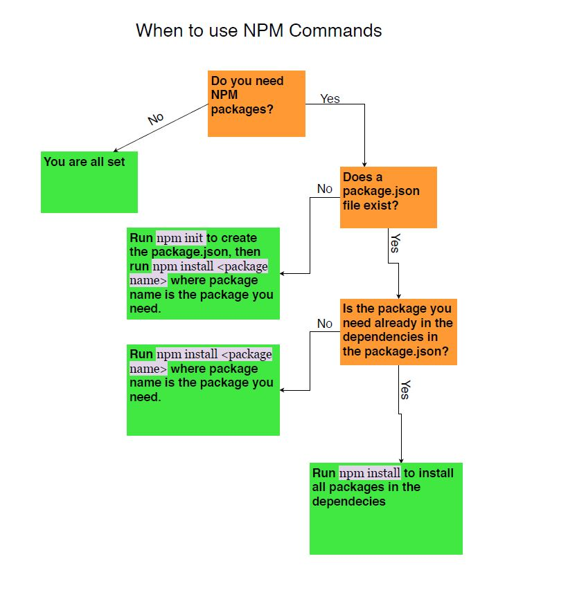
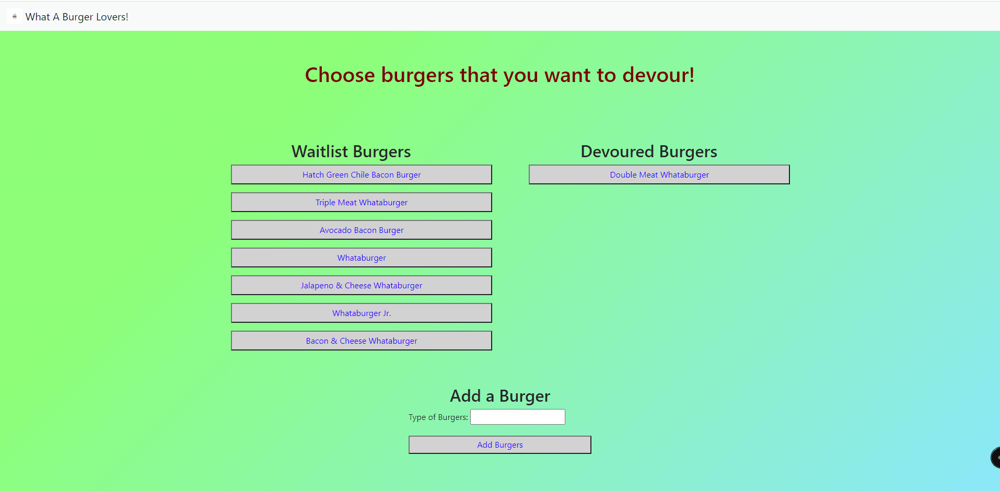
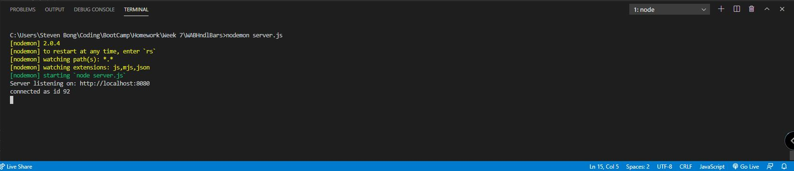
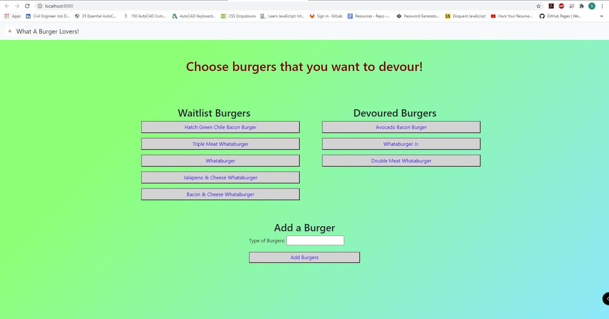

# Eat A Burger

## Description 
The objective of this HW is to familiarize the students in using the combination of ORM and SQL connection querries. This HW specifically determines the students ability in building the front-end and back-end application called Eat A Burger where all the things need to be done dynamically or using JavaScript. In addition to that, there's an additional language that has been used which is the handlebars where used to build the front-end application. This HW needs to utilize those languages in changing the status of a burger from waitlist to devour without adding front-end code to the page. Each of the folders is containing it's own purposes to make this application works. 
    
## Table of Contents
* [Installation](#installation)
* [Usage](#usage)
* [Credits](#credits)
* [License](#license)

## Installation 
This application requires few installation to made, which are the mysql, express, and express-handlebars packages. To install both packages, the steps will be explained by screenshot listed as below:
 
  
## Usage 
If there is any confusion in using this application, then users can utitlize the video on this repository. The full video on showing how to use this team proile generator will be shown below:
  

  
## Contributions
 

Language Contributions

To use the badges, feel free to check [shields.io](https://shields.io/) website for variety of badges

## Test Instruction 
Proof of test result of this application works (Shown by Connection ID)

## License 
  
MIT License

## Application Screenshot

